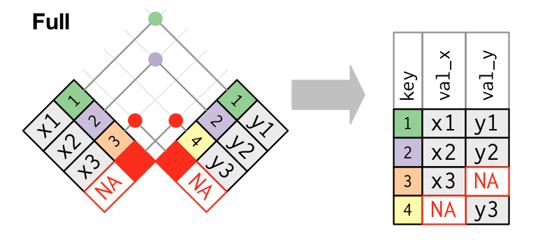

```{r setup, include=FALSE}
options(htmltools.dir.version = FALSE)
r <- getOption("repos")
r["CRAN"] <- "https://cloud.r-project.org/"
options(repos = r)
```

<style>

.remark-slide-number {
  position: inherit;
}

.remark-slide-number .progress-bar-container {
  position: absolute;
  bottom: 0;
  height: 6px;
  display: block;
  left: 0;
  right: 0;
}

.remark-slide-number .progress-bar {
  height: 100%;
  background-color: #f2a900;
}

.orange {
  color: #f2a900;
}
</style>

# Recap

.font130[

We learned:
 + `qplot`: quick way to make ggplot graphs.
 + `ggplotly`: transform ggplot objects into nice plotly viz.
 + `plot_ly`: create nice plotly graphs.
 + `dplyr` methods: data wrangling

Do you have any questions about any of these contents?

The quiz will be online at 4:00PM today.

Our GitHub page is: https://github.com/umbertomig/qtm151
]

---

# dplyr Recap and Today's Agenda

.font130[

`dplyr` is great for the following data manipulation: 
+ filter
+ arrange
+ select
+ rename
+ mutate
+ summarise and group_by

* **dplyr is also great to merge datasets together**
]

---

class: inverse, center, middle

# Getting Started

<html><div style='float:left'></div><hr color='#f2a900' size=1px width=720px></html> 

---

# Getting Started: loading packages

.font130[
```{r}
# Loading tidyverse
library(tidyverse)
```
]

---

# Loading data

.font130[
```{r, tidy=FALSE}
band <- tribble(
   ~name,     ~band,
  "Mick",  "Stones",
  "John", "Beatles",
  "Paul", "Beatles")

instrument <- tribble(
    ~name,   ~plays,
   "John", "guitar",
   "Paul",   "bass",
  "Keith", "guitar")

instrument2 <- tribble(
    ~artist,   ~plays,
   "John", "guitar",
   "Paul",   "bass",
  "Keith", "guitar")
```
]

---

# Loading data

.font130[
```{r, tidy=FALSE}
# Loading PErisk dataset
PErisk <- read.csv('https://raw.githubusercontent.com/umbertomig/qtm151/main/datasets/PErisk.csv') # or your locale folder
head(PErisk, 2)

# First dataset
dat1 <- PErisk %>% 
  filter(country %in% PErisk$country[1:5]) %>%
  select(country, courts:prsexp2)
dat1

# Second dataset
dat2 <- PErisk %>% 
  filter(country %in% PErisk$country[2:6]) %>%
  select(country, prscorr2, gdpw2)
dat2
```
]

---

class: inverse, center, middle

# Join Datasets

<html><div style='float:left'></div><hr color='#f2a900' size=1px width=720px></html> 


---

# Join Datasets

.font130[
Join two or more datasets together is a common problem in data wrangling.

Lucky us, `dplyr` makes the job easy. Here are the functions we can use:

|  Function  |                     Description                     |
|:----------:|:---------------------------------------------------:|
| inner_join | Keep data in both datasets                          |
| left_join  | Keep all data in the left dataset                   |
| right_join | Keep all data in the right dataset                  |
| full_join  | Keep all data in both datasets                      |
| semi_join  | Keep cases in the first that are also in the second |
| anti_join  | Keep cases in the first that are NOT in the second  |


]

---

class: inverse, center, middle

# left_join

<html><div style='float:left'></div><hr color='#f2a900' size=1px width=720px></html> 

---

# left_join

.font130[
*left_join(x, y, by="key variable")*: join the datasets, keeping all the observations (rows) in x

* A key is a variable that uniquely identifies an observation, otherwise, we need multiple variables to identify an observation.


]

---

# left_join

.font130[
Example:

```{r}
dat<-left_join(band, instrument, by="name")
dat
```

**Your turn:** Join the datasets `dat1` and `dat2` using left_join. Describe what happened.

]

---

class: inverse, center, middle

# right_join

<html><div style='float:left'></div><hr color='#f2a900' size=1px width=720px></html> 

---

# right_join

.font130[

*right_join(x, y, by="")*: keep all the observations (rows) in y

* The opposite way of *left_join()*


]

---

# right_join

.font130[
Example:

```{r}
dat<-right_join(band,instrument, by="name")
dat
```

**Your turn:** Join the datasets `dat1` and `dat2` using right_join. Describe what happened.

]

---

class: inverse, center, middle

# inner_join

<html><div style='float:left'></div><hr color='#f2a900' size=1px width=720px></html> 

---

# inner_join

.font130[

*inner_join()* keeps all the observations in **both** x and y

An inner join keeps observations that appear in both tables. But unmatched rows are not included in the result, it is easy to lose observations. 

]

---

# inner_join

.font130[
Example:

```{r}
inner_join(band, instrument, by="name")
```

**Your turn:** Join the datasets `dat1` and `dat2` using inner_join. Describe what happened.

]

---


class: inverse, center, middle

# full_join

<html><div style='float:left'></div><hr color='#f2a900' size=1px width=720px></html> 

---

# full_join

.font130[

*full_join* keeps all observations in x and y

An full_join keeps observations that appear in either x or y.



]

---

# full_join

.font130[
Example:

```{r}
full_join(band, instrument, by="name")
```

**Your turn:** Join the datasets `dat1` and `dat2` using full_join Describe what happened.

]

---


class: inverse, center, middle

# semi_join

<html><div style='float:left'></div><hr color='#f2a900' size=1px width=720px></html> 

---

# semi_join

.font130[

*semi_join(x,y, by="")* keeps all the observations of x that have a match in y

Use semi_join() to collect the artists in *band* that have instrument info in *instrument*.


]

---

# semi_join

.font130[
Example:

```{r}
semi_join(band, instrument, by="name")
```

**Your turn:** Join the datasets `dat1` and `dat2` using semi_join. Describe what happened.

]

---


class: inverse, center, middle

# anti_join

<html><div style='float:left'></div><hr color='#f2a900' size=1px width=720px></html> 

---

# anti_join

.font130[

*anti_join(x,y, by="")* drops all the observations of x that have a match in y.

*anti_join()* also provide a great way to diagnose joins that go wrong.


]

---

# anti_join

.font130[
Example:

```{r}
anti_join(band, instrument, by="name")
```

**Your turn:** Join the datasets `dat1` and `dat2` using anti_join. Describe what happened.

]

---

class: inverse, center, middle

# Questions?

<html><div style='float:left'></div><hr color='#f2a900' size=1px width=720px></html>

---

class: inverse, center, middle

# Have a great weekend!

<html><div style='float:left'></div><hr color='#f2a900' size=1px width=720px></html>