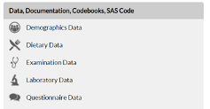

```{r setup, include=FALSE}
options(htmltools.dir.version = FALSE)
r <- getOption("repos")
r["CRAN"] <- "http://cran.cnr.berkeley.edu/"
options(repos = r)
```

<style>

.remark-slide-number {
  position: inherit;
}

.remark-slide-number .progress-bar-container {
  position: absolute;
  bottom: 0;
  height: 6px;
  display: block;
  left: 0;
  right: 0;
}

.remark-slide-number .progress-bar {
  height: 100%;
  background-color: #EB811B;
}

.orange {
  color: #EB811B;
}
</style>

# Final Project

.font150[

* Today, we will talk about your final project.

* I will create random groups of five students in Canvas.

* And I have four types of projects that each of your groups can implement.

* I'll pitch each project, and at the end you have to select a project for your group.
]

---
class: inverse, center, middle

# Option 1 - National Health and Nutrition Examination Survey

<html><div style='float:left'></div><hr color='#EB811B' size=1px width=720px></html> 

---

# NHANES

.font130[
The [National Health and Nutrition Examination Survey (NHANES)](https://www.cdc.gov/nchs/nhanes/index.htm) is a program designed to assess the health and nutritional status of adults and children in the US.

The survey examines a nationally representative sample of about 5,000 persons each year. It combines interviews and physical examinations. 

The NHANES program began in the early 1960s and has been conducted as a series of surveys focusing on different population groups or health topics.

All questionnaires, datasets, and related documentation are publicly accessible at: https://wwwn.cdc.gov/nchs/nhanes/Default.aspx
]

---

# NHANES

.font130[
For your final project, as a first option, please use NHANES 2017-2018 data wave.
* The only reason for not doing this is if you want to analyze the data over time.

If you are interested in analyzing trends over the years, my second option suggestion, you can also look into other data collected in previous years. 
  + Note that each wave is cross-sectional: from year to year, it was NOT repeated measurements from the same individuals.

]

---

# NHANES

.font130[

* Choose 2-3 data files from the available list and merge them according to your analytical goals.


 
* The data files are in SAS format (XPT), which can be imported into R using the following commands:

```
  library (Hmisc)
  library (SASxport)
  a <- read.xport ("file_name.xpt")
```
]

---
class: inverse, center, middle

# Option 2 -- Expedia

<html><div style='float:left'></div><hr color='#EB811B' size=1px width=720px></html> 

---

# Expedia

.font150[
This dataset is provided by Expedia.com, a travel website, which is used to book airline tickets, hotels, car rentals, and vacation packages. 

The dataset file and video will be on Canvas. 

Hint: this is a large dataset, please start small (one random sample of the dataset).
]

---

class: inverse, center, middle

# Option 3 -- COVID

<html><div style='float:left'></div><hr color='#EB811B' size=1px width=720px></html> 

---

# COVID

.font150[
COVID-19 is still disrupting our way of life.

There are several scholars collecting datasets on COVID around the world

Moreover, NYTimes has built great dataviz on the subject, all in R.

My suggestion is for you to explore the packages about the subject.
]

---

class: inverse, center, middle

# Option 4 -- World Data

<html><div style='float:left'></div><hr color='#EB811B' size=1px width=720px></html> 

---

# World Data

.font130[
The Quality of Government Institute collects data from all over the world, since 1946 (some variables even early!)

They organize a few datasets that merge together scholars' data, plus their own collected variables.

There are several types of datasets:
  * Time-Series Cross-Section
  * Cross-Section only data
  * Surveys with experts
  * And many others!
]

---

class: inverse, center, middle

# Rules

<html><div style='float:left'></div><hr color='#EB811B' size=1px width=720px></html> 

---

# Final Project: Rules

.font150[
To receive full marks you will have to apply skills you learned from this course to:
  - import
  - tidy, transform, wrangle
  - and visualize the data 
  
You also have to prepare 2-3 slides to present the results with your teammates. Five minutes presentations!
]

---

# Final Project: Rules

.font130[
Each project will be judge by:
  - Insight and creativity of the project
  - Data visualization of the project
  - Clarity of the presentation
  
Important Deadlines:
  - Mar 26: Submit your one-page project proposal on Canvas (2pts)
  - Mar 30: I will notify you my decision / talk to you if I feel the project is unrealistic.
  - Apr 23: Final submission on Canvas (4pts)
  - Apr 30: Presentation (4pts)
]


---
class: inverse, center, middle

# Questions?

<html><div style='float:left'></div><hr color='#EB811B' size=1px width=720px></html> 

---

class: inverse, center, middle

# Have a great weekend!

<html><div style='float:left'></div><hr color='#EB811B' size=1px width=720px></html> 